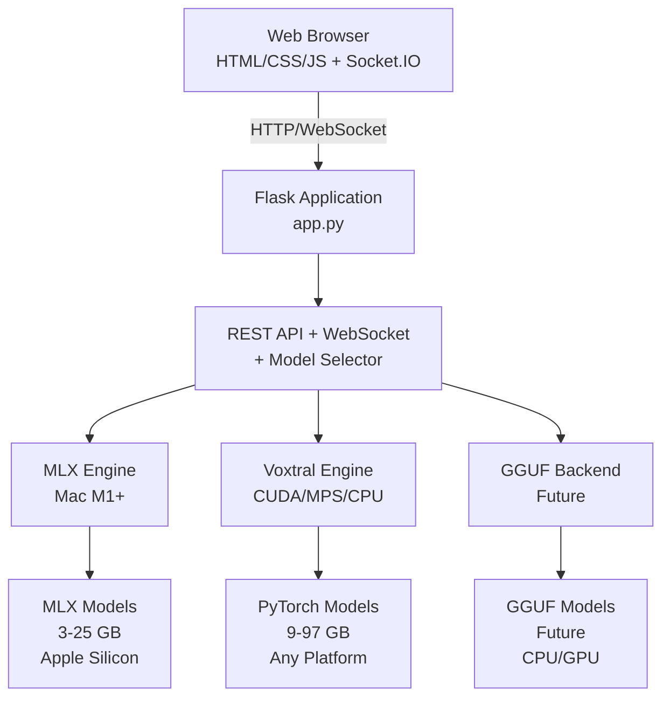

# Voxtral Transcription Application

A Flask-based web application for transcribing audio and video files using the Mistral AI Voxtral-Mini-3B model. Features a modern web interface with real-time progress updates, REST API, and WebSocket support, while leveraging local AI processing for privacy-focused, cost-free transcription.


## Features

### Web Application
- 🌐 **Modern Web Interface** - User-friendly drag-and-drop file upload
- ⚡ **Real-Time Progress** - Live updates via WebSocket during transcription
- 📊 **Progress Tracking** - Visual progress bar with chunk-by-chunk updates
- 📋 **Easy Export** - Copy to clipboard or download as text file
- 🎨 **Responsive Design** - Works on desktop and mobile browsers

### Transcription
- 🎵 **Audio & Video Support** - WAV, MP3, FLAC, M4A, MP4, AVI, MOV
- 🎬 **FFmpeg Pre-Conversion** - Converts complex formats to clean PCM WAV for reliable processing
- 🌍 **30+ Languages** - Multilingual support (English, French, Spanish, and more)
- 🗣️ **Auto Language Detection** - Automatically detects language per chunk using SpeechBrain
- 🔄 **Smart Chunking** - 90-second chunks optimized for multi-language content
- 🎚️ **Audio Normalization** - Automatic volume normalization for better recognition
- 🎯 **High Accuracy** - Powered by Mistral AI Voxtral-Mini-3B model

### Performance & Privacy
- 🚀 **Device Auto-Detection** - MPS (Apple Silicon), CUDA (NVIDIA GPU), or CPU
- 🔒 **Privacy-Focused** - All processing on local hardware, no cloud uploads
- 💰 **No API Costs** - Completely free to use
- ⚙️ **Efficient Memory** - Smart chunking prevents memory overflow
- 📊 **Memory Monitoring** - Real-time RAM usage warnings to prevent system slowdown
- 🔄 **Auto-Updates** - Automatic update notifications from GitHub releases

## Architecture



## Available Models

| Model | Size | Platform | RAM Required | Load Time | Best For |
|-------|------|----------|--------------|-----------|----------|
| **MLX Mini 3B (4-bit)** | 3.2 GB | Mac M1/M2/M3/M4 | 4-5 GB | < 1 min | ⭐ Recommended for Mac |
| **MLX Mini 3B (8-bit)** | 5.3 GB | Mac M1/M2/M3/M4 | 6-7 GB | < 2 min | Better quality on Mac |
| **MLX Small 24B (8-bit)** | 25 GB | Mac (64GB+ RAM) | 50-60 GB | 5-10 min | Best quality on Mac |
| **Voxtral Mini 3B (Full)** | 9.4 GB | Any (CUDA/MPS/CPU) | 20-30 GB | 10-30 min | Cross-platform |
| **Voxtral Mini 3B (4-bit)** | 9.4 GB | NVIDIA GPU | 5-8 GB | 2-5 min | NVIDIA GPU users |
| **Voxtral Small 24B (Full)** | 97 GB | GPU (55GB+ VRAM) | 55+ GB | N/A | Enterprise GPUs |
| **Voxtral Small 24B (4-bit)** | 97 GB | NVIDIA (16GB+) | 16-20 GB | 5-10 min | High-end NVIDIA |

### Model Selection Guide

**Apple Silicon Mac (M1/M2/M3/M4):**
- 8-16 GB RAM → MLX Mini 3B (4-bit) ⭐
- 16-32 GB RAM → MLX Mini 3B (8-bit)
- 64+ GB RAM → MLX Small 24B (8-bit)

**NVIDIA GPU:**
- 8 GB VRAM → Voxtral Mini 3B (4-bit)
- 16+ GB VRAM → Voxtral Small 24B (4-bit)

**CPU Only (Windows/Linux):**
- Voxtral Mini 3B (Full) - slow but works

## Requirements

- **Python 3.11 or later**
- **Operating System:** macOS, Linux, or Windows
- **Disk Space:** 3-25 GB depending on model (see table above)
- **RAM:** 4-60 GB depending on model (see table above)
- **Internet:** Required for initial model download only

### Required

- **FFmpeg** - For audio/video pre-conversion (ensures reliable processing)
  - macOS: `brew install ffmpeg`
  - Windows: Download from [ffmpeg.org](https://ffmpeg.org/download.html) or `choco install ffmpeg`
  - Linux: `sudo apt install ffmpeg`

## Quick Start

### Easiest (Double-Click)

| Platform    | First Time                                       | After Setup              |
|-------------|--------------------------------------------------|--------------------------|
| **macOS**   | Double-click `Start Voxtral Web - Mac.command`   | Same - just double-click |
| **Windows** | Double-click `Start Voxtral Web - Windows.bat`   | Same - just double-click |

Both launchers will prompt you to run setup if needed on first use.

### Terminal (Alternative)

**macOS/Linux:**

```bash
cd transcribe-voxtral-main/VoxtralApp
./setup.sh           # First time only
./start_web.sh       # Start the app
```

**Windows:**

```cmd
cd transcribe-voxtral-main\VoxtralApp
python -m venv voxtral_env && voxtral_env\Scripts\activate.bat && pip install -r requirements.txt
start_web.bat
```

### Use the App

1. Open `http://localhost:8000` in your browser
2. Drag and drop an audio/video file
3. Select the language and click "Start Transcription"
4. Copy or download your transcript when done

## Project Structure

```
transcribe-voxtral-main/VoxtralApp/
├── app.py                      # Flask web application
├── transcription_engine.py     # Core transcription logic
├── transcribe_voxtral.py       # CLI script for batch processing
├── requirements.txt            # Production dependencies
├── requirements-dev.txt        # Development dependencies
├── static/
│   ├── css/                   # Stylesheets
│   ├── js/                    # JavaScript frontend
│   └── assets/                # Images and icons
├── templates/
│   └── index.html             # Main web interface
├── tests/                      # Comprehensive test suite
├── docs/
│   ├── API_DOCUMENTATION.md   # API reference
│   └── USER_GUIDE.md          # User manual
├── uploads/                    # Temporary uploads (auto-cleanup)
├── transcriptions_voxtral_final/  # Saved transcripts
└── voxtral_env/               # Python virtual environment
```

## Launcher Icons

Need a branded icon for the macOS `.command` launcher or the Windows `.bat` shortcut? New PNG, `.icns`, and `.ico` assets live under `assets/icons/`. Follow the short walkthrough in `docs/icon-guide.md` to apply them to your preferred launcher.

## Usage Modes

### Web Interface (Recommended)

Perfect for interactive use with real-time feedback:

```bash
cd transcribe-voxtral-main/VoxtralApp
./start_web.sh  # or start_web.bat on Windows
```

Access at `http://localhost:8000`

**Features:**
- Drag-and-drop file upload
- Live progress updates
- Visual feedback
- Copy/download transcripts
- Language selection

### Command Line (Batch Processing)

For automating multiple files or integration with scripts:

```bash
cd transcribe-voxtral-main/VoxtralApp
source voxtral_env/bin/activate
python transcribe_voxtral.py
```

**Features:**
- Batch processing of all audio files in a directory
- Headless operation
- Scriptable and automatable
- Lower memory overhead

## Supported Languages

The Voxtral model supports 30+ languages:

| Code | Language | Code | Language | Code | Language |
|------|----------|------|----------|------|----------|
| `en` | English | `fr` | French | `es` | Spanish |
| `de` | German | `it` | Italian | `pt` | Portuguese |
| `nl` | Dutch | `pl` | Polish | `ru` | Russian |
| `zh` | Chinese | `ja` | Japanese | `ko` | Korean |
| `ar` | Arabic | `hi` | Hindi | `tr` | Turkish |
| `sv` | Swedish | `da` | Danish | `no` | Norwegian |
| `fi` | Finnish | `cs` | Czech | `sk` | Slovak |
| `uk` | Ukrainian | `ro` | Romanian | `el` | Greek |
| `he` | Hebrew | `id` | Indonesian | `vi` | Vietnamese |
| `th` | Thai | `ms` | Malay | `ca` | Catalan |

## API Documentation

The Flask application provides a REST API and WebSocket interface for programmatic access.

### REST Endpoints

- `POST /api/upload` - Upload audio/video file
- `POST /api/transcribe` - Start transcription job
- `GET /api/status/<job_id>` - Get job status
- `GET /api/transcript/<job_id>` - Retrieve transcript
- `GET /api/transcript/<job_id>/download` - Download as file
- `GET /api/languages` - Get supported languages
- `GET /api/device-info` - Get device information
- `GET /api/system/memory` - Get current memory usage and status
- `GET /api/version` - Get current application version
- `GET /api/updates/check` - Check for available updates from GitHub

### WebSocket Events

- `transcription_progress` - Real-time progress updates
- `transcription_complete` - Completion notification
- `transcription_error` - Error notifications
- `memory_warning` - Real-time memory usage warnings (80%+ RAM)

For complete API reference, see [VoxtralApp/docs/API_DOCUMENTATION.md](VoxtralApp/docs/API_DOCUMENTATION.md)

## Configuration

### Web Application Settings

Edit `app.py` to configure:

```python
MAX_FILE_SIZE = 500 * 1024 * 1024  # 500MB (line 26)
UPLOAD_FOLDER = BASE_DIR / "uploads"  # Upload directory (line 23)
OUTPUT_FOLDER = BASE_DIR / "transcriptions_voxtral_final"  # Output (line 24)
```

### Transcription Engine Settings

Edit `transcription_engine.py` to configure:

```python
chunk_duration_s: int = 2 * 60  # Chunk size in seconds (line 150)
sample_rate: int = 16000  # Audio sample rate (line 151)
```

### CLI Script Settings

Edit `transcribe_voxtral.py` to configure batch processing:

```python
INPUT_DIRECTORY = "."  # Where to find audio files
OUTPUT_SUBFOLDER_NAME = "transcriptions_voxtral_final"  # Output folder
```

## Device Detection & Performance

The application automatically detects and uses the best available hardware:

### Processing Speed (Approximate)

| Device | Speed | Example (10 min audio) |
|--------|-------|------------------------|
| Apple M1/M2/M3 (MPS) | ~1-2x realtime | 5-10 min processing |
| NVIDIA GPU (CUDA) | ~1-3x realtime | 3-10 min processing |
| CPU (Fallback) | ~0.1-0.5x realtime | 20-100 min processing |

**Note:** Actual speed varies based on audio quality, language, and specific hardware

### Device Details

**MPS (Apple Silicon)**
- M1, M2, M3, M4 chips
- Uses `bfloat16` precision
- Automatic cache clearing
- Fastest on Apple devices

**CUDA (NVIDIA GPUs)**
- Requires CUDA-compatible GPU
- Uses `bfloat16` precision
- Requires CUDA toolkit

**CPU (Universal)**
- Works on all systems
- Uses `float32` precision
- Slower but reliable

## Testing

The application includes a comprehensive test suite with pytest.

### Run Tests

```bash
cd transcribe-voxtral-main/VoxtralApp

# Activate test environment
source test_venv/bin/activate

# Run all tests (excluding model/GPU tests)
export TESTING=1
pytest tests/ -v -m "not requires_model and not requires_gpu and not slow"

# Run specific test categories
pytest tests/test_api.py -v          # API tests
pytest tests/test_integration.py -v  # Integration tests
pytest tests/ -v -m unit            # Unit tests only
```

### Test Categories

- `unit` - Unit tests for individual components
- `api` - API endpoint tests
- `integration` - Integration tests
- `slow` - Long-running tests
- `requires_model` - Tests needing the ML model (skipped in CI)
- `requires_gpu` - Tests requiring GPU (skipped in CI)
- `cross_platform` - Platform compatibility tests

For more details, see [VoxtralApp/tests/README.md](VoxtralApp/tests/README.md)

## Model Information

**Model:** Mistral AI Voxtral-Mini-3B-2507

- **Type:** Conditional Generation (Audio-to-Text)
- **Size:** ~20GB download
- **Architecture:** Transformer-based encoder-decoder
- **Sample Rate:** 16kHz (automatically resampled)
- **License:** [HuggingFace Model Page](https://huggingface.co/mistralai/Voxtral-Mini-3B-2507)

### First Run

The model is downloaded automatically on first use:

- **Download Size:** ~20GB
- **Download Time:** 10-60 minutes (depends on internet speed)
- **Cache Location:** `~/.cache/huggingface/hub/`
- **Redownload:** Not needed - model is cached locally

### Subsequent Runs

- Model loads from cache in 10-30 seconds
- No internet connection required
- Processing starts immediately

## Troubleshooting

### Application Won't Start

**Check Python version:**
```bash
python --version  # Should be 3.11+
```

**Reinstall dependencies:**
```bash
pip install -r requirements.txt --force-reinstall
```

### Can't Access Web Interface

**Solutions:**
1. Verify server is running (check terminal output)
2. Try `http://127.0.0.1:5000` instead
3. Check if port 5000 is in use
4. Check firewall settings

### Model Download Fails

**Solutions:**
1. Ensure 20GB+ free disk space
2. Check internet connection
3. Check firewall/proxy settings
4. Downloads resume automatically - try again

### Out of Memory Errors

**Solutions:**
1. Close other applications
2. Reduce chunk size in `transcription_engine.py`
3. Process shorter files
4. Restart your computer

### Poor Transcription Quality

**Solutions:**
1. **Verify correct language selected**
2. Use high-quality audio (minimal background noise)
3. Ensure adequate audio volume
4. Try with clear speech examples first

### Video Conversion Fails

**Solutions:**
1. Install FFmpeg (see requirements)
2. Install moviepy: `pip install moviepy`
3. Convert video manually using FFmpeg
4. Try different video format

For detailed troubleshooting, see [VoxtralApp/docs/USER_GUIDE.md](VoxtralApp/docs/USER_GUIDE.md)

## Development

### Code Quality

**Format code:**
```bash
cd transcribe-voxtral-main/VoxtralApp
source test_venv/bin/activate

# Auto-format with black
black app.py transcription_engine.py transcribe_voxtral.py tests/*.py

# Sort imports
isort app.py transcription_engine.py transcribe_voxtral.py tests/*.py --skip test_venv
```

**Lint code:**
```bash
flake8 . --config=.flake8
```

### Contributing

1. Run tests before committing
2. Follow code style (black, isort)
3. Add tests for new features
4. Update documentation

## Documentation

- **[User Guide](VoxtralApp/docs/USER_GUIDE.md)** - Complete user manual
- **[API Documentation](VoxtralApp/docs/API_DOCUMENTATION.md)** - API reference
- **[Test Documentation](VoxtralApp/tests/README.md)** - Testing guide
- **[Implementation Plan](VoxtralApp/IMPLEMENTATION_PLAN.md)** - Design document
- **[CLAUDE.md](../CLAUDE.md)** - Claude Code guidance

## Dependencies

### Core
- **torch** - Deep learning framework
- **torchaudio** - Audio processing for PyTorch
- **transformers** - HuggingFace model interface
- **librosa** - Audio processing and normalization
- **soundfile** - Audio file I/O
- **speechbrain** - Automatic language detection
- **Flask** - Web framework
- **Flask-SocketIO** - Real-time WebSocket support
- **mistral-common** - Mistral AI utilities
- **psutil** - System memory monitoring

### Development
- **pytest** - Testing framework
- **black** - Code formatting
- **isort** - Import sorting
- **flake8** - Linting

See [requirements.txt](VoxtralApp/requirements.txt) and [requirements-dev.txt](VoxtralApp/requirements-dev.txt) for complete list.

## Privacy & Security

- ✅ **100% Local Processing** - No cloud uploads
- ✅ **No Data Collection** - No analytics or tracking
- ✅ **Open Source** - Fully auditable code
- ✅ **No Account Required** - Use immediately
- ✅ **Automatic Cleanup** - Temporary files deleted after processing

## Best Practices

1. **Test First** - Start with a short audio clip to verify setup
2. **Correct Language** - Always select the spoken language
3. **Quality Audio** - Use clear recordings for best results
4. **Adequate Storage** - Ensure 20GB+ free for model + files
5. **Monitor Progress** - Watch first transcription to verify quality
6. **Save Transcripts** - Download/copy before closing browser

## Memory Monitoring & System Health

The application includes intelligent memory monitoring to prevent system slowdown:

### Memory Warning Levels

- **Normal (< 80% RAM)** - No warnings, optimal performance
- **Warning (80-90% RAM)** - Yellow banner appears, transcription continues
- **Critical (> 90% RAM)** - Red banner appears, consider stopping transcription

### Automatic Optimizations

The transcription engine automatically adjusts based on available memory:
- **< 2GB available** - Uses 60-second chunks (reduced memory footprint)
- **2-4GB available** - Uses 90-second chunks (balanced performance)
- **> 4GB available** - Uses 120-second chunks (optimal performance)

### Memory Management Features

- **Real-time Monitoring** - Memory status checked every 15 seconds
- **WebSocket Alerts** - Instant warnings when RAM usage exceeds thresholds
- **Automatic Cleanup** - Garbage collection after each audio chunk
- **Device Cache Clearing** - MPS/CUDA caches cleared between chunks
- **Visual Banners** - Clear on-screen warnings with RAM percentage

### Best Practices for Large Files

1. **Close Other Applications** - Free up RAM before transcribing
2. **Monitor Banners** - Watch for memory warnings during processing
3. **Restart if Needed** - Stop transcription if critical warning appears
4. **Chunk Size** - System automatically adjusts based on available RAM

## Versioning & Updates

The application uses semantic versioning (vMAJOR.MINOR.PATCH) and automatically checks for updates.

### Current Version

Check your version at startup or via the API:
```bash
curl http://localhost:8000/api/version
```

### Automatic Update Checks

- **On Startup** - Checks GitHub for new releases when app starts
- **Update Banner** - Green notification appears when new version available
- **Release Information** - Click "View Release" to see changelog and download

### Manual Update Check

```bash
curl http://localhost:8000/api/updates/check
```

### Updating the Application

When a new version is available:

1. **View Release Notes** - Click the banner link to see what's new
2. **Download Update** - Download from GitHub releases page
3. **Stop Application** - Close the web interface (server auto-shuts down)
4. **Replace Files** - Extract new version over existing installation
5. **Restart** - Launch application normally

### Version File

The current version is stored in:
```
VoxtralApp/VERSION
```

### GitHub Releases

All releases are published at: `https://github.com/debrockb/transcribe-voxtral/releases`

## License

For educational and research purposes. Check Mistral AI's license terms for the Voxtral model at [HuggingFace Model Page](https://huggingface.co/mistralai/Voxtral-Mini-3B-2507)

## Support

For issues or questions:

1. **User Guide** - See [USER_GUIDE.md](VoxtralApp/docs/USER_GUIDE.md) for detailed help
2. **API Docs** - See [API_DOCUMENTATION.md](VoxtralApp/docs/API_DOCUMENTATION.md) for technical details
3. **Test Docs** - See [tests/README.md](VoxtralApp/tests/README.md) for testing help
4. **Troubleshooting** - Check error messages and logs in terminal

## Acknowledgments

Powered by:
- **Mistral AI** - Voxtral-Mini-3B model
- **HuggingFace** - Transformers library
- **Flask** - Web framework
- **LibROSA** - Audio processing
- **Socket.IO** - Real-time communications

---

Thank you for using Voxtral Transcription Application! 🎙️
